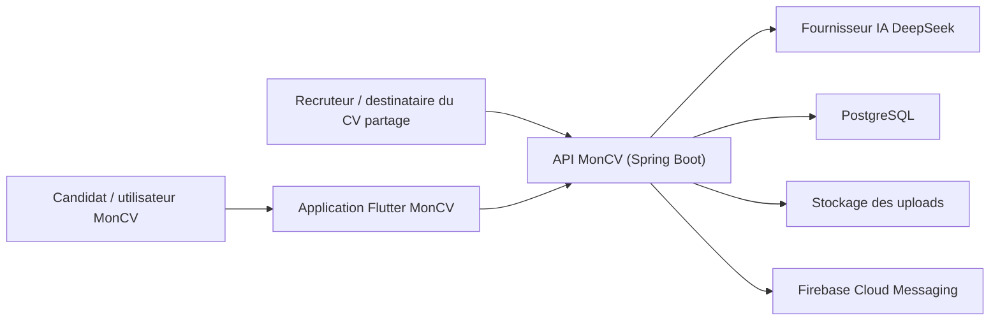
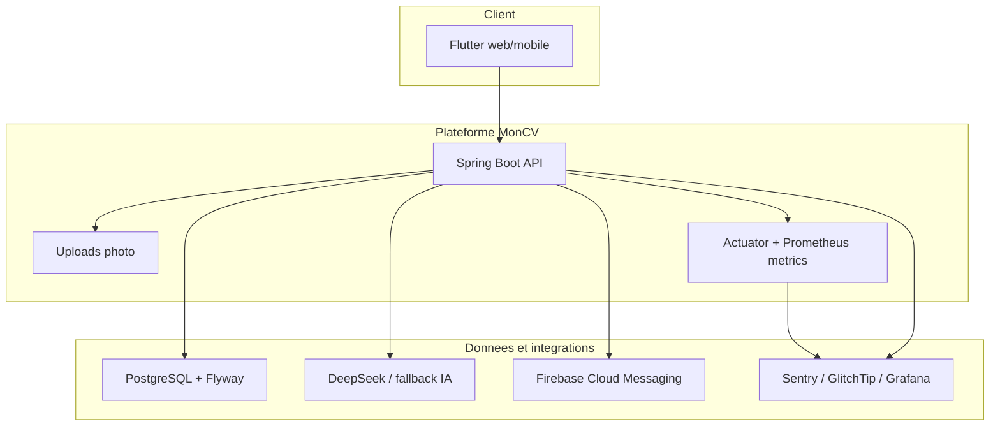
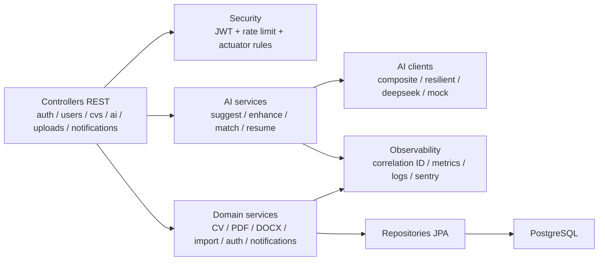
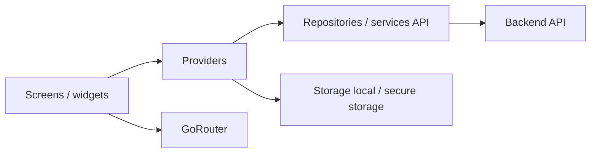

# Architecture MonCV

Ce document suit une vue C4 simplifiee : contexte, conteneurs, composants.

## 1. System Context

## 2. Container View

## 3. Backend Component View

## 4. Flutter Component View

## 5. Flux critiques

### Creation d'un CV

1. Flutter collecte le formulaire.
2. L'API valide le `CvRequest`.
3. `CvService` persiste le CV via JPA.
4. Les metriques `cv.created.total` sont incrementees.
5. Le client recharge la liste et le detail.

### Generation IA

1. Le client appelle `/api/ai/...`.
2. Le controleur transmet l'identifiant de l'utilisateur JWT au use case.
3. Le service charge le CV par `(cvId, userId)` dans une transaction ; un CV
   absent ou tiers produit le meme `404`, sans construire ni envoyer de prompt.
4. Le backend passe ensuite seulement par `CompositeAiClient`.
5. `ResilientAiClient` applique retry / circuit breaker / timeout.
6. DeepSeek repond ou un fallback mock est utilise selon la panne.
7. Les appels sont journalises sans contenu CV brut.

### Export PDF / DOCX

1. Flutter demande un export sur `/api/cvs/{id}/pdf` ou `/docx`.
2. L'API recharge le CV complet par `(id, userId)` et retourne le meme `404`
   pour un identifiant absent ou tiers.
3. Le service de generation construit le document.
4. Le backend renvoie un binaire telechargeable.

## 6. Decisions structurantes

- Backend monolithique modulaire pour garder un cout d'operation bas.
- Flutter unique pour web et mobile afin de partager l'essentiel du produit.
- PostgreSQL comme source de verite, avec Flyway pour les migrations.
- IA encapsulee derriere des clients resilience4j pour limiter l'impact fournisseur.
- Observabilite native au backend: correlation ID, logs structures, metriques business.
