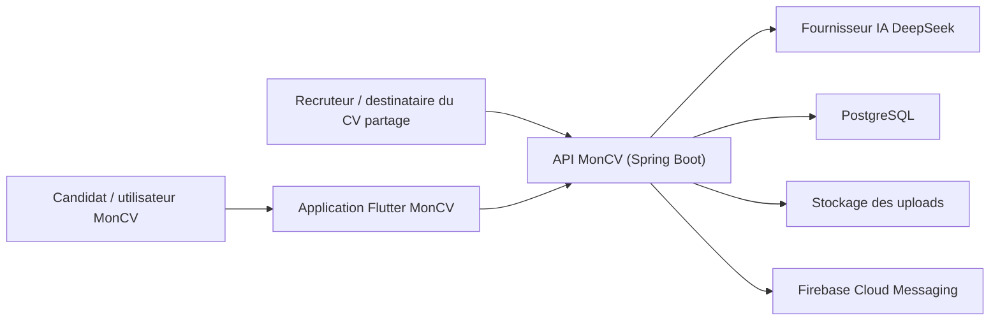
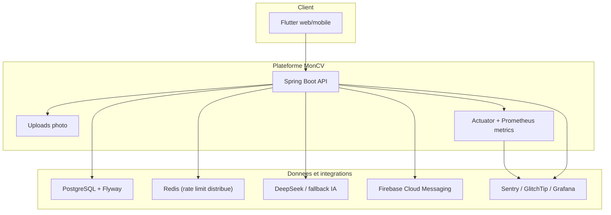
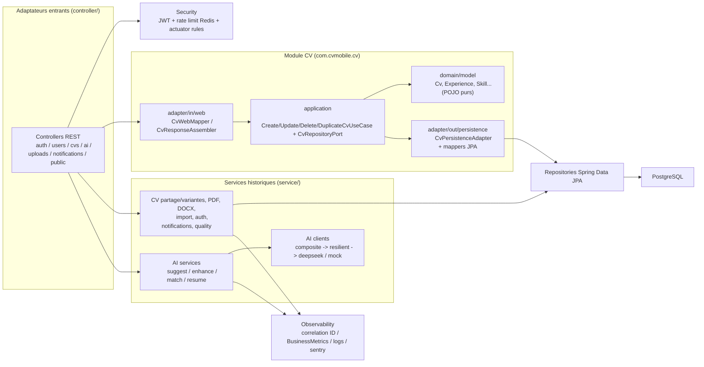
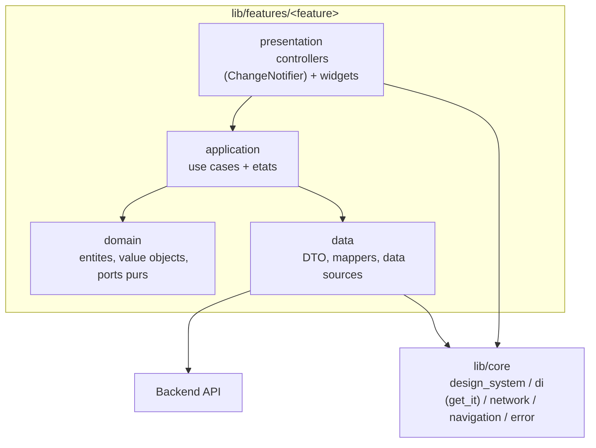

# Architecture MonCV

Ce document suit une vue C4 simplifiee : contexte, conteneurs, composants,
puis les flux critiques et l'etat d'architecture livre par l'EPIC #231.

> Les decisions structurantes sont formalisees dans les ADR
> ([`adr/`](adr/)) — ce document decrit l'etat **actuel du code**, les ADR
> justifient les choix. En cas de divergence, le code fait foi : signaler
> l'ecart plutot que d'aligner la doc a l'aveugle.

## 1. System Context

## 2. Container View

Dependances confirmees dans [`backend/pom.xml`](../backend/pom.xml) : actuator +
`micrometer-registry-prometheus`, `sentry-spring-boot-starter-jakarta`,
`resilience4j-spring-boot3`, `flyway-core`. Le rate limiting distribue Redis est
porte par [`security/RedisRateLimitService.java`](../backend/src/main/java/com/cvmobile/security/RedisRateLimitService.java)
(seule implementation de `RateLimitService`, sur Bucket4j + Lettuce).

## 3. Backend Component View

Le backend est un **monolithe modulaire** (ADR 003) dans une phase de
migration livree : la feature CV est un **slice hexagonal complet**, les autres
capacites restent organisees par type et se decoupent en sous-services (voir
section 7).

Points verifies dans le code :

- **Slice CV hexagonal** :
  [`cv/application/usecase/CreateCvUseCase.java`](../backend/src/main/java/com/cvmobile/cv/application/usecase/CreateCvUseCase.java)
  recoit un agregat de domaine `Cv` et delegue a
  [`cv/application/port/out/CvRepositoryPort.java`](../backend/src/main/java/com/cvmobile/cv/application/port/out/CvRepositoryPort.java) ;
  le port est exprime en types de domaine et implemente par
  [`cv/adapter/out/persistence/CvPersistenceAdapter.java`](../backend/src/main/java/com/cvmobile/cv/adapter/out/persistence/CvPersistenceAdapter.java).
- **Hybride assume** :
  [`controller/CvController.java:44-59`](../backend/src/main/java/com/cvmobile/controller/CvController.java#L44-L59)
  cable les use cases migres (CRUD) **et** le service historique `ICvService`
  pour le partage public et les variantes (dependances non encore migrees,
  tranches #255-C+/E documentees dans le code).
- **God-classes decomposees** : la generation PDF eclate en
  [`service/pdf/section/`](../backend/src/main/java/com/cvmobile/service/pdf/section)
  (interface `PdfSectionRenderer` + un renderer par bloc du CV) +
  [`service/pdf/template/`](../backend/src/main/java/com/cvmobile/service/pdf/template)
  (4 templates : Classique, Creatif, Minimaliste, Moderne) +
  [`service/pdf/style/`](../backend/src/main/java/com/cvmobile/service/pdf/style) ;
  l'IA en sous-services dedies (`SuggestionServiceImpl`,
  `EnhancementServiceImpl`, `JobMatchServiceImpl`, `ResumeGeneratorServiceImpl`)
  plus des collaborateurs unitaires (`CvPromptBuilder`, `AiLogSanitizer`,
  `AiResponseParser`) dans [`service/ai/`](../backend/src/main/java/com/cvmobile/service/ai).

## 4. Flutter Component View

L'application Flutter est organisee **par fonctionnalite** (`lib/features/*` +
`lib/core`), avec un residu historique par type (`screens/`, `providers/`,
`services/`...) maintenu en compatibilite pendant la fin de migration (section 7).

Reference concrete, le module CV
([`mobile/lib/features/cv/`](../mobile/lib/features/cv)) est un slice complet :
`domain/{entities,value_objects,validation,policies}`,
`application/{usecase,state,sync}`, `data/{dto,mappers,codec,repositories}`,
`presentation/{controllers,store,widgets}`. La direction des dependances pointe
toujours vers le domaine (ADR 002).

## 5. Flux critiques

### Creation d'un CV

1. Flutter collecte le formulaire (`features/cv/presentation`).
2. L'API valide le `CvRequest` ; l'adaptateur web
   ([`CvWebMapper`](../backend/src/main/java/com/cvmobile/cv/adapter/in/web/CvWebMapper.java))
   assemble l'agregat de domaine `Cv`.
3. [`CreateCvUseCase`](../backend/src/main/java/com/cvmobile/cv/application/usecase/CreateCvUseCase.java)
   persiste via `CvRepositoryPort` dans une transaction.
4. La metrique `cv.created.total` est incrementee (`BusinessMetrics`).
5. Le client recharge la liste et le detail.

### Generation IA

1. Le client appelle `/api/ai/...`.
2. Le controleur transmet l'identifiant de l'utilisateur JWT au use case.
3. Le service charge le CV par `(cvId, userId)` dans une transaction ; un CV
   absent ou tiers produit le meme `404`, sans construire ni envoyer de prompt.
4. Le backend passe ensuite seulement par
   [`CompositeAiClient`](../backend/src/main/java/com/cvmobile/service/ai/client/CompositeAiClient.java)
   (chaine `primary -> fallback`, cablee `resilientDeepSeek -> mockAiClient`).
5. `ResilientAiClient` applique retry / circuit breaker / timeout (resilience4j).
6. Le fallback mock ne se declenche que sur `AiProviderDownException`
   (5xx / timeout / circuit ouvert), pas sur une erreur metier.
7. Les appels sont journalises sans contenu CV brut (`AiLogSanitizer`).

### Export PDF / DOCX

1. Flutter demande un export sur `/api/cvs/{id}/pdf` ou `/docx`.
2. L'API recharge le CV complet par `(id, userId)` et retourne le meme `404`
   pour un identifiant absent ou tiers.
3. Le service de generation construit le document (renderers de section pour le
   PDF, `DocxGenerationService` pour le DOCX).
4. Le backend renvoie un binaire telechargeable.

## 6. Decisions structurantes

- Backend monolithique modulaire pour garder un cout d'operation bas.
- Flutter unique pour web et mobile afin de partager l'essentiel du produit.
- PostgreSQL comme source de verite, avec Flyway pour les migrations.
- IA encapsulee derriere des clients resilience4j pour limiter l'impact fournisseur.
- Observabilite native au backend : correlation ID, logs structures, metriques business.

## 7. Etat d'architecture livre (EPIC #231)

L'EPIC #231 a fait evoluer l'organisation **par type** vers une organisation
**par fonctionnalite** (Clean Architecture cote Flutter, hexagonale cote
backend), de facon incrementale et sans big-bang. Les decisions sont dans deux
ADR : [`adr/002-flutter-clean-architecture.md`](adr/002-flutter-clean-architecture.md)
et [`adr/003-backend-modular-monolith.md`](adr/003-backend-modular-monolith.md).

L'etat livre est **hybride assume** : la cible existe et est verrouillee en CI,
la migration des modules restants se poursuit derriere des garde-fous
decroissants.

### Ce qui est livre

| Couche | Cible atteinte | Residu en migration |
| --- | --- | --- |
| Flutter | `lib/features/<feature>/{domain,application,data,presentation}` + `lib/core` (218 fichiers de features, 34 de core) | Dossiers historiques `screens/`, `providers/`, `usecases/`, `services/` maintenus en compatibilite |
| Backend | Module `com.cvmobile.cv` en hexagonal complet (domain / application+ports / adapters in-web & out-persistence) | Autres capacites en `com.cvmobile.{controller,service,repository,model}`, decoupees en sous-services |

Direction des dependances : **toujours vers le domaine**. La presentation ne
parle qu'a l'application/domaine ; le domaine ignore Flutter, HTTP, Spring et JPA.

### Garde-fous executables en CI

- **Backend — ArchUnit**
  ([`LayeredArchitectureTest.java`](../backend/src/test/java/com/cvmobile/architecture/LayeredArchitectureTest.java)) :
  regle **active** « aucun controller ne depend d'un repository » (zero
  violation) ; regle **gelee** « le domaine ne depend pas de Spring Security »
  avec une allowlist reduite au seul `User implements UserDetails`, a lever
  quand #255 aura sorti la securite du modele. Un test meta prouve que la regle
  detecte encore une violation reelle.
- **Flutter — test de purete du domaine**
  ([`test/architecture/domain_purity_test.dart`](../mobile/test/architecture/domain_purity_test.dart)) :
  interdit tout import `dart:ui` / `package:flutter/` / `presentation/` depuis
  `lib/features/*/domain/`. **Allowlist vide (tolerance zero)** : les 7
  violations revelees par la migration #416 ont ete corrigees (#465, #466,
  #468).

> Note : la CI mobile s'appuie sur ce test d'architecture, et non sur
> `custom_lint` (absent du projet : `mobile/pubspec.yaml` ne declare que
> `flutter_lints`). L'ADR 002 evoquait `custom_lint` comme garde-fou envisage —
> l'implementation livree est un test executable equivalent.

### Dette restante tracee

- Backend : partage public et variantes CV encore portes par `ICvService`
  historique (tranches #255-C+/E) ; `User` implemente `UserDetails` (#255).
- Flutter : providers et use cases historiques (`lib/providers/`,
  `lib/usecases/`) coexistent avec les slices de features le temps de leur
  reprise.
